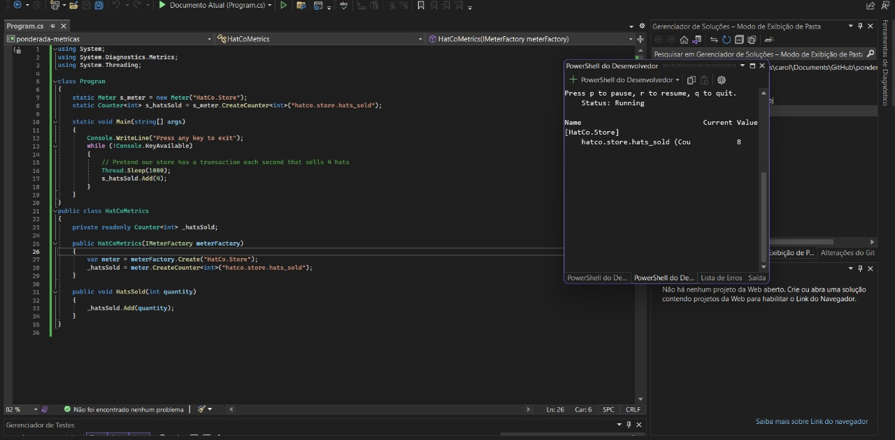
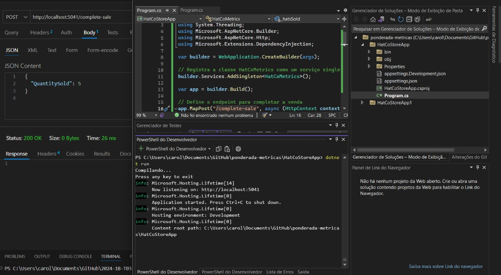

# Relatório do Projeto API de Vendas de Chapéus HatCo

## Introdução

Este relatório detalha o desenvolvimento da API HatCo, uma aplicação ASP.NET Core projetada para gerenciar as transações de vendas de chapéus e coletar métricas de desempenho usando a funcionalidade de instrumentação de métricas do .NET. O projeto visa ilustrar a criação de métricas personalizadas e a obtenção de um medidor por meio da injeção de dependência, conforme as diretrizes da [documentação oficial do .NET](https://learn.microsoft.com/pt-br/dotnet/core/diagnostics/metrics-instrumentation).

## Implementação

### Criar uma métrica personalizada
O codigo pode ser achado na pasta <a href="https://github.com/CFFricks/ponderada-metricas/tree/main/HatCoStoreApp1" >HatCoStoreApp1</a>
<br> </br>
A implementação envolveu definir uma métrica para monitorar a quantidade de chapéus vendidos.

```csharp
using System;
using System.Diagnostics.Metrics;
using System.Threading;

class Program
{
    static Meter s_meter = new Meter("HatCo.Store");
    static Counter<int> s_hatsSold = s_meter.CreateCounter<int>("hatco.store.hats_sold");

    static void Main(string[] args)
    {
        Console.WriteLine("Press any key to exit");
        while(!Console.KeyAvailable)
        {
            // Pretend our store has a transaction each second that sells 4 hats
            Thread.Sleep(1000);
            s_hatsSold.Add(4);
        }
    }
}
```

## Print ilustrando o funcionamento:


# Obtenha um Medidor por meio da injeção de dependência
O codigo pode ser achado na pasta <a href="https://github.com/CFFricks/ponderada-metricas/tree/main/HatCoStoreApp" >HatCoStoreApp</a>

## Endpoint API
Implementei o endpoint "/complete-sale" que processa as vendas e utiliza a métrica para registrar a quantidade de chapéus vendidos:
```csharp
app.MapPost("/complete-sale", async (HttpContext context, HatCoMetrics metrics) => {
    var request = await context.Request.ReadFromJsonAsync<SaleModel>();
    if (request == null) {
        context.Response.StatusCode = 400; // Bad Request
        return;
    }

    metrics.HatsSold(request.QuantitySold);
    context.Response.StatusCode = 200; // OK
});
```
## Print mostrando o funcionamento:


